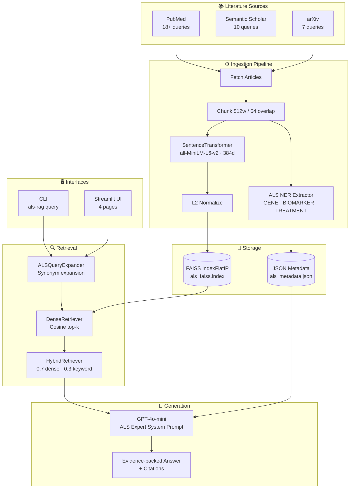
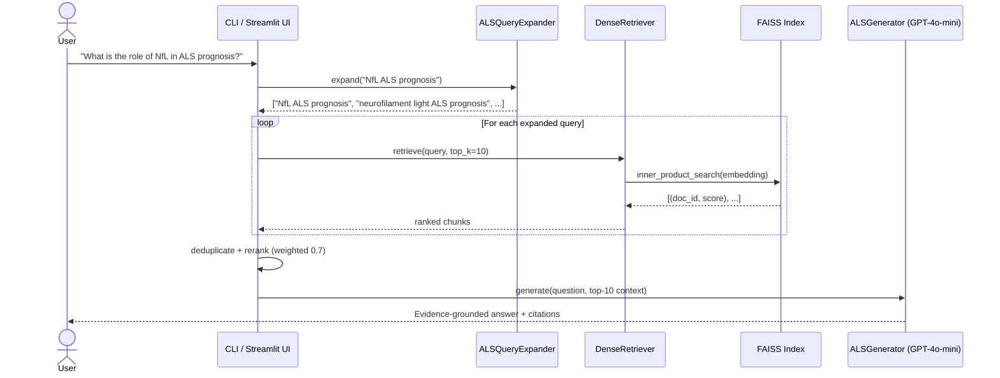
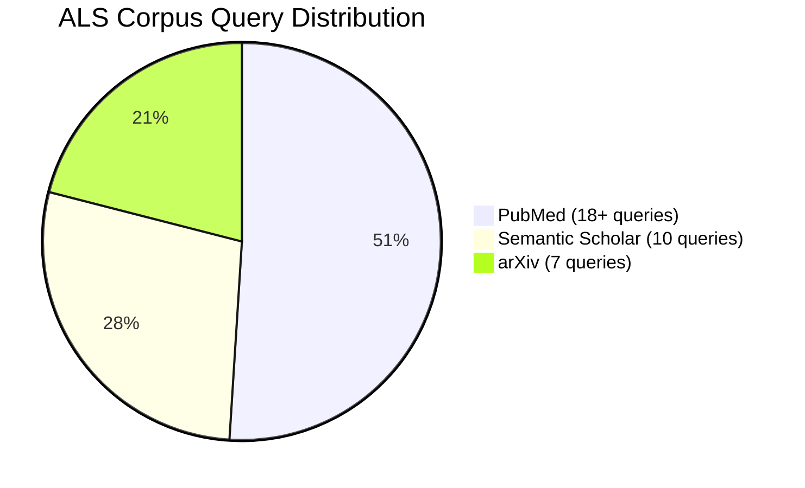
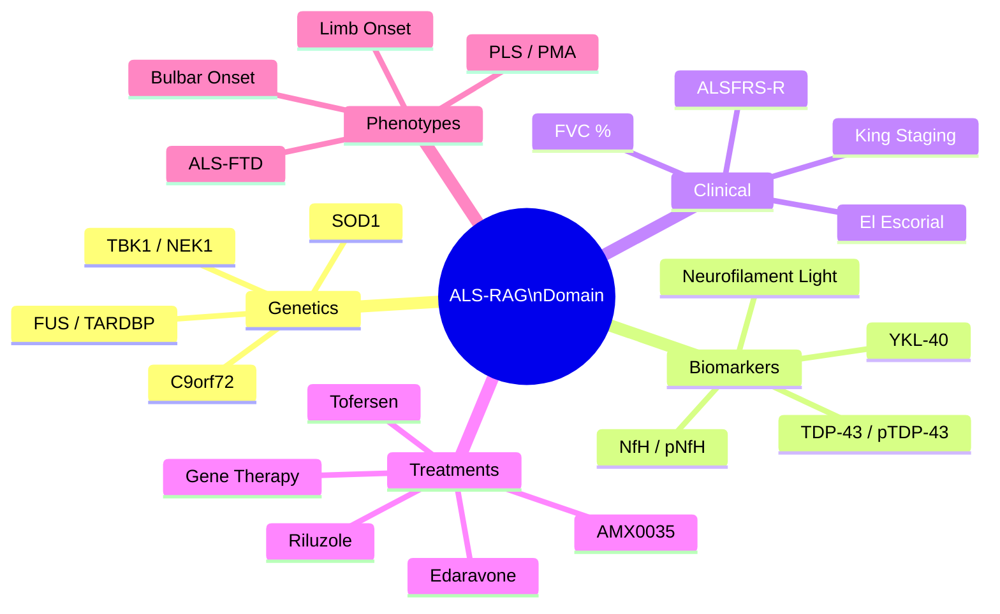
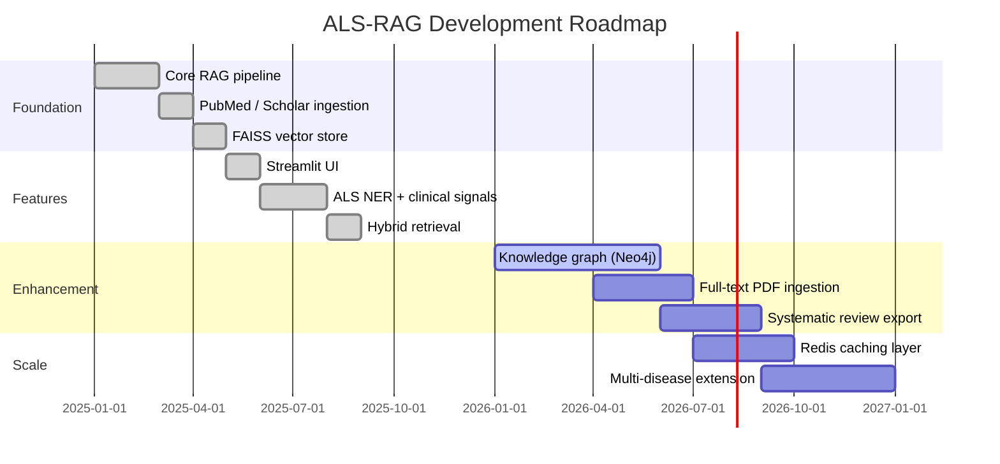

<div align="center">
  <h1>🧠 ALS-RAG</h1>
  <p><em>Retrieval-Augmented Generation for ALS Research Literature — evidence-grounded answers from PubMed, Semantic Scholar, and arXiv.</em></p>
</div>

<div align="center">

[](LICENSE)
[](https://github.com/hkevin01/als-rag/stargazers)
[](https://github.com/hkevin01/als-rag/network)
[](https://github.com/hkevin01/als-rag/commits/main)
[](https://github.com/hkevin01/als-rag)
[](https://github.com/hkevin01/als-rag/issues)
[](https://python.org)
[](https://openai.com)
[](https://faiss.ai)
[](https://streamlit.io)

</div>

---

## Table of Contents

- [Overview](#overview)
- [Key Features](#key-features)
- [Architecture](#architecture)
- [Usage Flow](#usage-flow)
- [ALS Domain Coverage](#als-domain-coverage)
- [Technology Stack](#technology-stack)
- [Setup & Installation](#setup--installation)
- [Usage](#usage)
- [Core Capabilities](#core-capabilities)
- [Roadmap](#roadmap)
- [Development Status](#development-status)
- [Contributing](#contributing)
- [License & Acknowledgements](#license--acknowledgements)

---

## Overview

ALS-RAG is a domain-specialized Retrieval-Augmented Generation (RAG) system for **Amyotrophic Lateral Sclerosis (ALS) research**. It aggregates scientific literature from PubMed, Semantic Scholar, and arXiv, encodes it into a FAISS vector index, and serves evidence-grounded answers through a Streamlit multi-page UI or a single-command CLI.

**The problem it solves:** ALS researchers and clinicians need rapid, citation-backed synthesis of a rapidly growing literature spanning genetics, biomarkers, clinical trials, and emerging therapeutics. General-purpose LLMs hallucinate domain-specific facts; ALS-RAG grounds every answer in real indexed papers with full source attribution.

**Audience:** ALS clinical researchers, neurologists, PhD students studying motor neuron disease, and bioinformatics teams building systematic review pipelines.

> [!IMPORTANT]
> ALS-RAG is a **research tool**. It is not a clinical decision support system and must not be used for patient diagnosis or treatment without independent clinical validation.

<p align="right">(<a href="#top">back to top ↑</a>)</p>

---

## Key Features

| Icon | Feature | Description | Impact | Status |
|------|---------|-------------|--------|--------|
| 📥 | Multi-source ingestion | 18+ PubMed, 10 Scholar, 7 arXiv ALS queries | Broad, deep corpus | ✅ Stable |
| 🔬 | Domain NER | Gene, biomarker, drug, scale, subtype extraction | Structured entity index | ✅ Stable |
| 🔍 | Hybrid retrieval | Dense (0.7) + ALS synonym query expansion (0.3) | High-recall search | ✅ Stable |
| 🧬 | Clinical signal matching | ALSFRS-R, FVC, onset phenotype → literature queries | Case-based retrieval | ✅ Stable |
| 🤖 | Evidence-grounded generation | GPT-4o-mini with ALS expert system prompt + citation rules | Citation-backed answers | ✅ Stable |
| 🖥️ | Streamlit web UI | Search, Corpus Stats, Clinical Features, About pages | Accessible interface | ✅ Stable |
| ⌨️ | CLI | Single-command queries with `--ingest`, `--top-k`, `--verbose` | Automation-friendly | ✅ Stable |
| 📊 | FAISS IndexFlatIP | L2-normalized cosine similarity, 384-dim embeddings | Sub-second retrieval | ✅ Stable |

- **Ingestion pipeline** chunks text at 512 words (64-word overlap), embeds with `sentence-transformers/all-MiniLM-L6-v2`, L2-normalizes, and stores in a persistent FAISS `IndexFlatIP`.
- **Query expansion** maps ALS domain synonyms (e.g., `tofersen → BIIB067`, `neurofilament → NfL, pNfH`) to maximize recall on dense retrieval.
- **NER extractor** identifies 5 entity types (GENE, BIOMARKER, CLINICAL_SCALE, TREATMENT, ALS_SUBTYPE) plus numeric measurements (ALSFRS scores, FVC %, NfL pg/mL, study sample sizes).
- **Clinical feature extraction** converts structured EMG/NCS records into natural-language retrieval queries using Awaji criteria and ALSFRS-R domain scoring.
- The generation model runs at `temperature=0.2` to favor factual precision, with `max_tokens=1500` and a 8,000-character context window.

<p align="right">(<a href="#top">back to top ↑</a>)</p>

---

## Architecture

### System Architecture



**Data flow:** Literature is fetched from three academic sources, chunked into 512-word passages, embedded into 384-dimensional dense vectors, and stored in a FAISS inner-product index alongside JSON metadata. At query time the `HybridRetriever` expands the user query using ALS synonym mappings, runs multi-query dense retrieval, deduplicates and re-ranks results by weighted score, and passes the top-k context passages to GPT-4o-mini for citation-grounded synthesis.

**External integrations:** NCBI E-utilities (PubMed), Semantic Scholar Academic Graph API, arXiv REST API, OpenAI Chat Completions API.

<p align="right">(<a href="#top">back to top ↑</a>)</p>

---

## Usage Flow

### Query Sequence



### Step-by-Step Usage

```bash
# Ingest the corpus (first time or to refresh)
als-rag --ingest

# Ask a research question
als-rag "What is the efficacy of tofersen in SOD1-ALS?"

# Retrieve only — skip LLM generation
als-rag "C9orf72 repeat expansion prognosis" --no-generate

# Increase retrieved context
als-rag "AMX0035 clinical trial" --top-k 15

# Ingest then query in a single command
als-rag --ingest "neurofilament biomarker NfL prognosis"

# Verbose mode shows embedding, FAISS, and API logs
als-rag "ALSFRS-R progression biomarkers" --verbose
```

**Example output:**

```
=== Answer ===
Tofersen (BIIB067) is an antisense oligonucleotide targeting SOD1 mRNA. The
VALOR trial (Miller et al., 2022) demonstrated a 55% reduction in plasma NfL
over 28 weeks versus placebo (p < 0.001), with a trend toward slower ALSFRS-R
decline. A subsequent open-label extension confirmed durable NfL suppression...

=== Sources ===
1. Tofersen for SOD1 ALS (2022) score=0.847
   https://pubmed.ncbi.nlm.nih.gov/...
2. Neurofilament as endpoint in ALS trials (2021) score=0.791
```

<p align="right">(<a href="#top">back to top ↑</a>)</p>

---

## ALS Domain Coverage

### Literature Source Distribution



| Category | Examples | Entity Type |
|---|---|---|
| Genes | SOD1, C9orf72, FUS, TARDBP, TBK1, NEK1, UBQLN2, VCP, OPTN | GENE |
| Biomarkers | Neurofilament light (NfL), TDP-43, phospho-NfH, YKL-40, CK, IL-6 | BIOMARKER |
| Clinical scales | ALSFRS-R, FVC, King's staging, MiToS, El Escorial, Awaji criteria | CLINICAL_SCALE |
| Treatments | Riluzole, Edaravone, Tofersen/BIIB067, AMX0035, ASOs, gene therapy | TREATMENT |
| Phenotypes | Bulbar onset, limb onset, ALS-FTD, PLS, PMA, familial ALS | ALS_SUBTYPE |
| Measurements | ALSFRS-R score, FVC %, NfL pg/mL, MUAP amplitude, survival months | Numeric NER |

### ALS Domain Taxonomy



<p align="right">(<a href="#top">back to top ↑</a>)</p>

---

## Technology Stack

| Technology | Purpose | Why Chosen | Alternatives |
|------------|---------|------------|--------------|
| `sentence-transformers/all-MiniLM-L6-v2` | Dense text embedding (384d) | Fast, high-quality, open-source, domain-portable | BGE-small, E5-small |
| FAISS `IndexFlatIP` | Exact cosine nearest-neighbor search | Zero approximation error on L2-normalized vectors | Annoy, ScaNN, Pinecone |
| OpenAI GPT-4o-mini | Evidence-grounded answer generation | Cost-effective, strong instruction following | GPT-4o, Claude 3 Haiku |
| Streamlit | Multi-page web UI | Rapid prototyping, minimal frontend code | Gradio, FastAPI + React |
| PubMed E-utilities | Primary literature source | Gold-standard biomedical citations, free API | Europe PMC |
| Semantic Scholar API | Broad academic coverage | Citation graph enrichment, open access | Unpaywall, OpenAlex |
| arXiv REST API | Preprint literature source | Latest research, fully open access | bioRxiv, medRxiv |
| `tenacity` | API retry logic | Exponential backoff out of the box | Custom retry loops |
| `pydantic` v2 | Config and data validation | Fast, type-safe, Python-native | attrs, dataclasses |
| `uv` | Package management | 10–100× faster than pip, reproducible installs | pip, poetry, conda |
| `ruff` | Linting | Extremely fast, replaces flake8 + isort | flake8, pylint |
| `pytest` + `pytest-cov` | Testing | Industry-standard, rich plugin ecosystem | unittest |

<p align="right">(<a href="#top">back to top ↑</a>)</p>

---

## Setup & Installation

### Prerequisites

- Python 3.9 or higher
- [`uv`](https://docs.astral.sh/uv/) package manager (`pip install uv`)
- OpenAI API key (required for answer generation)
- PubMed contact email (required by NCBI ToS)

### Installation

```bash
# 1. Clone the repository
git clone https://github.com/hkevin01/als-rag.git
cd als-rag

# 2. Configure environment variables
cp .env.example .env
# Edit .env — add your API keys (see table below)
```

**`.env` configuration:**

```dotenv
OPENAI_API_KEY=sk-...           # Required — powers GPT-4o-mini generation
PUBMED_API_KEY=                 # Optional — raises PubMed rate limit to 10 req/s
SEMANTIC_SCHOLAR_API_KEY=       # Optional — raises Scholar request quota
CONTACT_EMAIL=you@domain.com    # Required by NCBI E-utilities Terms of Service
OPENAI_MODEL=gpt-4o-mini        # Optional — override generation model
```

| Variable | Required | Description |
|---|---|---|
| `OPENAI_API_KEY` | Yes (generation) | OpenAI API key |
| `PUBMED_API_KEY` | No (rate limit) | NCBI key: 3 → 10 req/s |
| `SEMANTIC_SCHOLAR_API_KEY` | No (rate limit) | Increased Scholar quota |
| `CONTACT_EMAIL` | Yes (PubMed ToS) | Your email for NCBI API |

```bash
# 3. Install all dependencies (dev + web extras)
make install

# 4. Ingest ALS literature corpus (~1,800 articles, ~10 minutes)
make ingest

# 5. Launch the Streamlit web UI
make run
# → Opens at http://localhost:8501

# 6. Verify setup with a test query
als-rag "What genes are associated with familial ALS?" --top-k 5
```

> [!TIP]
> Run `make ingest` once to bootstrap the FAISS index. Subsequent `als-rag` queries are sub-second — the index is persisted at `data/embeddings/als_faiss.index` and survives restarts.

<p align="right">(<a href="#top">back to top ↑</a>)</p>

---

## Usage

### Web UI

Launch with `make run` and navigate using the sidebar:

| Page | Description |
|------|-------------|
| **Search** | Enter a research question; get an AI-generated answer with source citations |
| **Corpus Stats** | Indexed document counts, source breakdown, year distribution |
| **Clinical Features** | Input ALSFRS-R, FVC, onset, genetics → case-matched literature retrieval |
| **About** | System information, model details, data sources |

Press <kbd>Ctrl</kbd>+<kbd>C</kbd> to stop the Streamlit server.

### Makefile Reference

```bash
make install    # Install package in editable mode with dev extras (uv)
make ingest     # Fetch and index ALS literature from all three sources
make run        # Launch Streamlit UI on port 8501
make test       # Run full pytest suite
make lint       # Ruff linting on src/ and tests/
make format     # Black auto-formatting (line length 88)
make typecheck  # mypy static type checking
make clean      # Delete FAISS index + metadata (forces re-ingest)
```

### Project Structure

```
als-rag/
├── src/als_rag/
│   ├── ingestion/          # PubMed, Scholar, arXiv clients + pipeline
│   ├── retrieval/          # Dense retriever, hybrid retriever, query expander
│   ├── storage/            # FAISS vector DB wrapper
│   ├── generation/         # OpenAI RAG generator (GPT-4o-mini)
│   ├── signals/            # ALS clinical feature extractor (ALSFeatures)
│   ├── web_ui/             # Streamlit app + 4 pages
│   └── cli/                # Command-line interface
├── tests/                  # pytest test suite
├── data/embeddings/        # FAISS index + JSON metadata (generated)
├── Makefile
└── pyproject.toml
```

<p align="right">(<a href="#top">back to top ↑</a>)</p>

---

## Core Capabilities

### 📥 Ingestion Pipeline

Articles are fetched from PubMed (18+ targeted ALS queries), Semantic Scholar (10 queries), and arXiv (7 queries). Each article's title + abstract is chunked into 512-word passages with 64-word overlap, embedded into 384-dimensional dense vectors using `all-MiniLM-L6-v2`, L2-normalized for cosine similarity, and added to a persistent FAISS `IndexFlatIP`. Duplicate detection uses MD5 hashes of PMID, DOI, or title — re-ingesting the same corpus is safe and idempotent.

> [!NOTE]
> The FAISS index grows incrementally. Run `make clean && make ingest` to rebuild from scratch if you want a fresh corpus.

### 🔬 Domain NER

The `ALSNERExtractor` applies vocabulary-based rule matching across five entity categories and regex extraction for numeric clinical measurements.

<details>
<summary>📋 Full NER Entity Vocabulary</summary>

**Genes (24):** SOD1, C9orf72, FUS, TARDBP/TDP-43, UBQLN2, VCP, OPTN, TBK1, SQSTM1, HNRNPA1, HNRNPA2B1, MATR3, TUBA4A, NEK1, KIF5A, SETX, ALS2/ALSIN, DCTN1, CHMP2B, ANG, VEGF, NEFH, PRPH

**Biomarkers (20+):** Neurofilament light (NfL/NFL), phospho-NfH (pNfH), TDP-43, phospho-TDP-43, FUS protein, YKL-40/CHI3L1, chitotriosidase, CK, uric acid, creatinine, IL-6, TNF-alpha, MCP-1, miR-206, miR-133, miR-9

**Clinical Scales (12):** ALSFRS-R, FVC, SVC, ATLIS, SNP, MRC scale, El Escorial, Awaji criteria, Gold Coast criteria, grip strength, King's staging, MiToS staging

**Treatments (18+):** Riluzole, Edaravone, Tofersen/BIIB067, AMX0035, sodium phenylbutyrate, TUDCA, rasagiline, mexiletine, baclofen, NIV/BiPAP, PEG, ASO, gene therapy, stem cell, iPSC

**Subtypes (10):** Bulbar onset ALS, limb onset ALS, flail arm, flail leg, PLS, PMA, ALS-FTD, familial ALS, sporadic ALS, juvenile ALS

**Numeric NER patterns:** ALSFRS-R scores, FVC % predicted, NfL pg/mL, survival months, study sample sizes (n=X)

</details>

### 🔍 Hybrid Retrieval

`HybridRetriever` combines dense cosine similarity (weight 0.7) with ALS-specific synonym query expansion. The `ALSQueryExpander` maps domain terms to synonyms (e.g., `tofersen → BIIB067, antisense oligonucleotide SOD1`) and issues up to 3 expanded queries, merging results by max-score deduplication with a 0.7× weight discount on secondary queries.

### 🧬 Clinical Signal Integration

`ALSFeatureExtractor` converts structured clinical records (EMG/NCS results, ALSFRS-R subscores, FVC %, genetics, imaging data) into natural-language retrieval queries. Classification uses the Awaji criteria and ALSFRS-R domain scoring (bulbar, fine motor, gross motor, respiratory).

<details>
<summary>🏥 Clinical Feature Domains</summary>

| Domain | Input Fields | Example |
|--------|-------------|---------|
| EMG / NCS | fasciculation score, denervation regions, MUAP amplitude µV | Awaji Grade 4, cervical + lumbar |
| Progression | ALSFRS-R total, slope (pts/month), disease duration | Score 38, −0.8 pts/month |
| Respiratory | FVC % predicted, sniff nasal pressure cmH2O | FVC 62 %, SNP 45 cmH2O |
| Genetics | SOD1 variant, C9orf72 repeat, FUS variant, TDP-43 pathology | C9orf72 positive |
| Cognitive | Cognitive impairment flag, behavioural variant (ALS-FTD) | Mild CI present |
| Imaging | UMN signs, LMN signs, corticospinal tract involvement scores | Both UMN + LMN present |

</details>

### 🤖 Evidence-Grounded Generation

`ALSGenerator` calls GPT-4o-mini with an ALS expert system prompt covering genetics, biomarkers, clinical scales, treatments, phenotypes, and pathophysiology. Up to 8,000 characters of retrieved context from top-k indexed passages are included. The model is instructed to cite source titles and years, state when context is insufficient, and never speculate beyond what the literature supports.

> [!WARNING]
> If `OPENAI_API_KEY` is not set, the system falls back to retrieval-only mode — ranked source list without a generated answer.

<details>
<summary>⚙️ Advanced Configuration</summary>

Override defaults via `.env` or environment variables:

| Variable / Config | Default | Description |
|-------------------|---------|-------------|
| `OPENAI_MODEL` | `gpt-4o-mini` | Override LLM (e.g. `gpt-4o`) |
| `OPENAI_API_KEY` | — | OpenAI secret key |
| `PUBMED_API_KEY` | — | NCBI key: 3 → 10 req/s |
| `SEMANTIC_SCHOLAR_API_KEY` | — | Increased Scholar quota |
| `CONTACT_EMAIL` | `als-rag@research.org` | Required by NCBI ToS |
| `Config.chunk_size` | `512` words | Edit `src/als_rag/utils/config.py` |
| `Config.chunk_overlap` | `64` words | Edit `src/als_rag/utils/config.py` |
| `Config.embedding_dim` | `384` | Matches `all-MiniLM-L6-v2` |
| `Config.default_top_k` | `10` | Retrieved passages per query |
| `HybridRetriever(dense_weight=)` | `0.7` | Dense vs. keyword balance |
| `Config.openai_temperature` | `0.2` | Lower = more factual |
| `Config.openai_max_tokens` | `1500` | Maximum answer length |

</details>

<p align="right">(<a href="#top">back to top ↑</a>)</p>

---

## Roadmap



| Phase | Goals | Target | Status |
|-------|-------|--------|--------|
| Foundation | Core RAG pipeline, ingestion, FAISS index | Q1–Q2 2025 | ✅ Complete |
| Features | Streamlit UI, NER, clinical signals, hybrid retrieval | Q3 2025 | ✅ Complete |
| Enhancement | Knowledge graph, PDF ingestion, systematic review export | Q2–Q3 2026 | 🟡 In Progress |
| Scale | Redis caching, multi-disease support (MS, PD, PMA) | Q4 2026+ | ⭕ Planned |

<p align="right">(<a href="#top">back to top ↑</a>)</p>

---

## Development Status

| Component | Version | Stability | Coverage | Known Limitations |
|-----------|---------|-----------|----------|-------------------|
| Ingestion Pipeline | 0.1.0 | Alpha | Unit tests | Rate limits on free API tiers |
| ALS NER Extractor | 0.1.0 | Alpha | Unit tests | Rule-based only; no ML NER model |
| FAISS Vector DB | 0.1.0 | Alpha | Integration | Flat index; scales past ~1M vectors with ANN |
| Hybrid Retriever | 0.1.0 | Alpha | Unit tests | Keyword weight reserved for future BM25 |
| ALSGenerator | 0.1.0 | Alpha | Mocked tests | Requires paid OpenAI API key |
| Streamlit UI | 0.1.0 | Alpha | Manual | Single-user; no authentication |
| CLI | 0.1.0 | Alpha | Integration | No streaming output yet |

```bash
make test        # Run full pytest suite
make typecheck   # mypy static analysis
make lint        # Ruff code quality checks
```

<p align="right">(<a href="#top">back to top ↑</a>)</p>

---

## Contributing

Contributions are welcome! Please follow this workflow:

1. **Fork** the repository on GitHub
2. **Create a feature branch**: `git checkout -b feature/your-feature-name`
3. **Commit** using [Conventional Commits](https://www.conventionalcommits.org/): `feat:`, `fix:`, `docs:`, `test:`
4. **Push** and open a **Pull Request** against `main`

<details>
<summary>📐 Development Guidelines</summary>

**Code style:**
- Formatting: `black` (line length 88)
- Linting: `ruff`
- Type hints: required on all new code; checked with `mypy`
- Import order: `isort` (enforced via ruff)

**Testing:**
- Add `pytest` tests for all new features under `tests/`
- Mock external API calls (PubMed, Semantic Scholar, OpenAI) using `pytest-mock`
- Maintain or improve coverage with `pytest-cov`

**Domain contributions:**
- Expanding `ALS_GENES`, `ALS_BIOMARKERS`, or `ALS_SYNONYMS` — please cite the source paper or authoritative gene list in the PR description
- Adding new literature queries — document the clinical rationale

```bash
# Full pre-commit check before opening a PR
make lint && make typecheck && make test
```

</details>

<p align="right">(<a href="#top">back to top ↑</a>)</p>

---

## License & Acknowledgements

**License:** MIT — see [LICENSE](LICENSE) for full terms.

Architecture adapts patterns from [eeg-rag](https://github.com/hkevin01/eeg-rag), originally built for EEG research literature, applied here to the ALS research domain.

**Data sources:**
- [NCBI PubMed](https://pubmed.ncbi.nlm.nih.gov/) — National Library of Medicine
- [Semantic Scholar](https://www.semanticscholar.org/) — Allen Institute for AI
- [arXiv.org](https://arxiv.org/) — Cornell University

**Key dependencies:** FAISS (Facebook AI Research), sentence-transformers (UKP Lab / Hugging Face), OpenAI Python SDK, Streamlit, PyTorch.

> [!NOTE]
> This tool is for research use only. Clinical decisions must always involve qualified medical professionals. ALS literature may contain preliminary findings that have not been independently replicated.
