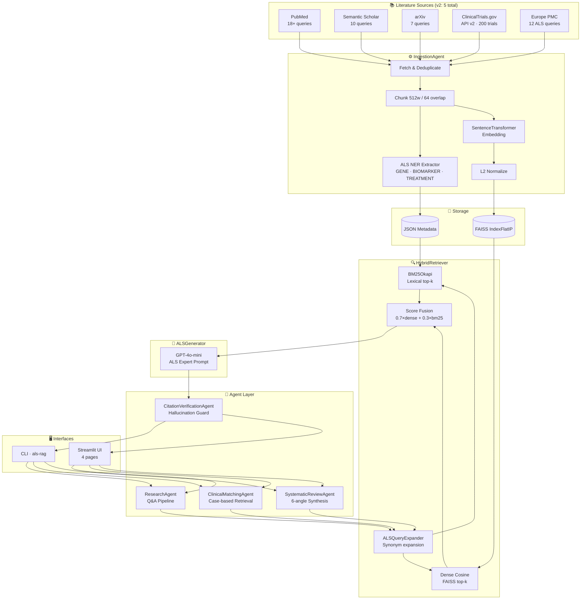
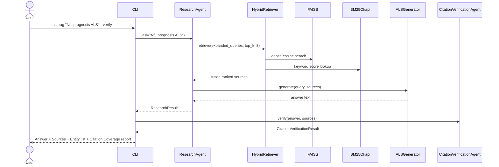
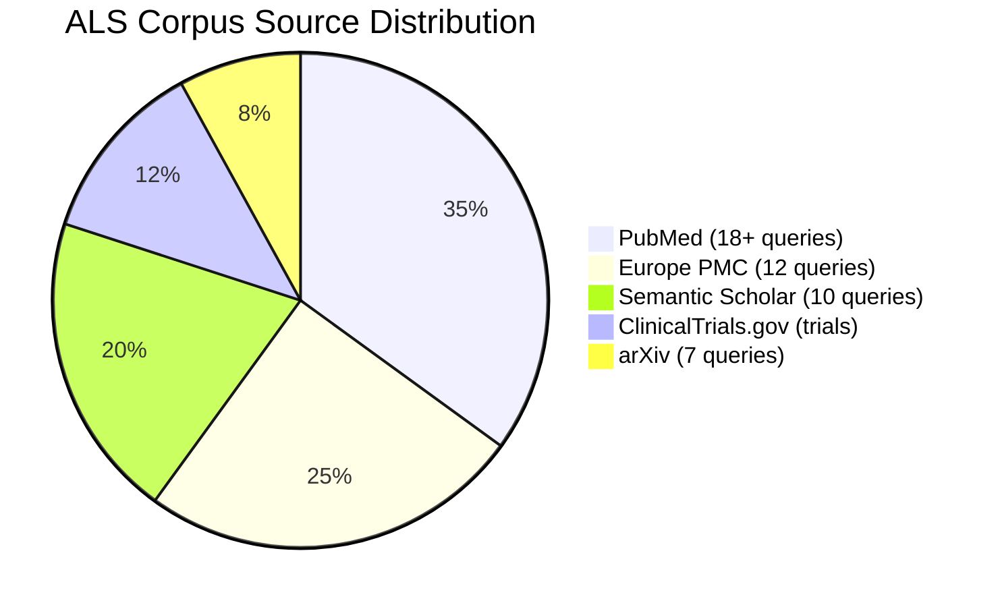
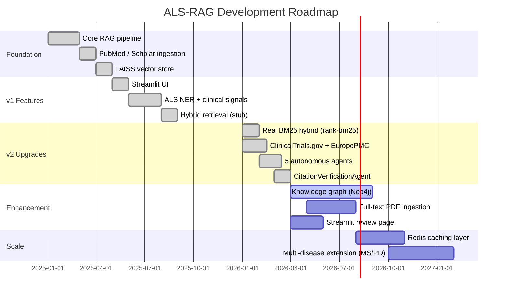

<div align="center">
  <h1>🧠 ALS-RAG</h1>
  <p><em>Retrieval-Augmented Generation for ALS Research Literature — evidence-grounded answers from PubMed, Semantic Scholar, arXiv, ClinicalTrials.gov, and Europe PMC.</em></p>
</div>

<div align="center">

[](LICENSE)
[](https://github.com/hkevin01/als-rag/stargazers)
[](https://github.com/hkevin01/als-rag/network)
[](https://github.com/hkevin01/als-rag/commits/main)
[](https://python.org)
[](https://openai.com)
[](https://faiss.ai)
[](https://streamlit.io)
[](https://github.com/dorianbrown/rank_bm25)
[](tests/)

</div>

---

## Table of Contents

- [Overview](#overview)
- [What's New in v2](#whats-new-in-v2)
- [Agents](#agents)
- [Key Features](#key-features)
- [Architecture](#architecture)
- [Usage Flow](#usage-flow)
- [ALS Domain Coverage](#als-domain-coverage)
- [Technology Stack](#technology-stack)
- [Setup & Installation](#setup--installation)
- [Usage](#usage)
- [Core Capabilities](#core-capabilities)
- [Roadmap](#roadmap)
- [Development Status](#development-status)
- [Contributing](#contributing)
- [License & Acknowledgements](#license--acknowledgements)

---

## Overview

ALS-RAG is a domain-specialised Retrieval-Augmented Generation (RAG) system for **Amyotrophic Lateral Sclerosis (ALS) research**. It aggregates scientific literature from five sources — PubMed, Semantic Scholar, arXiv, ClinicalTrials.gov, and Europe PMC — encodes it into a FAISS vector index with real BM25 hybrid scoring, and serves evidence-grounded answers through a Streamlit multi-page UI or a single-command CLI.

**The problem it solves:** ALS researchers and clinicians need rapid, citation-backed synthesis of a rapidly growing literature spanning genetics, biomarkers, clinical trials, and emerging therapeutics. General-purpose LLMs hallucinate domain-specific facts; ALS-RAG grounds every answer in real indexed papers and now includes a **CitationVerificationAgent** to automatically flag any sentences the LLM asserts that cannot be traced back to a retrieved source.

**Audience:** ALS clinical researchers, neurologists, PhD students studying motor neuron disease, and bioinformatics teams building systematic review pipelines.

> [!IMPORTANT]
> ALS-RAG is a **research tool**. It is not a clinical decision support system and must not be used for patient diagnosis or treatment without independent clinical validation.

<p align="right">(<a href="#top">back to top ↑</a>)</p>

---

## What's New in v2

### Summary of Upgrades

| # | Upgrade | Why Added | What It Adds | How to Use |
|---|---------|-----------|--------------|------------|
| 1 | **Real BM25 hybrid retrieval** (`rank-bm25`) | Previous keyword weight was a stub — 100% dense-only retrieval despite the 0.3 keyword weight in config. Added to complete hybrid scoring and boost recall for exact ALS terminology (gene names, trial IDs, drug names). | Integrates `BM25Okapi` from `rank_bm25`. Lazy-builds a BM25 index from the metadata JSON at first query. Fuses with dense cosine: `score = 0.7×dense + 0.3×bm25_normalised`. | Automatic — no flags needed. Works on any `als-rag query` once the corpus is indexed. |
| 2 | **ClinicalTrials.gov API v2** | ALS clinical trial eligibility, outcomes, and interventions are not in PubMed abstracts. Added to give the corpus structured trial data for intervention and eligibility queries. | New `ClinicalTrialsClient` — fetches up to 200 ALS trials with NCT ID, phase, sponsor, eligibility criteria, primary outcomes, and intervention names. Cursor-paginated. No API key needed. | `make ingest` (included by default) or `make ingest-all` |
| 3 | **Europe PMC REST API** | 40M+ biomedical articles not in PubMed including preprints, patents, and European clinical guidelines. 12 ALS-targeted queries sorted by citation count. | New `EuropePMCClient` with 12 domain queries covering TDP-43, SOD1, C9orf72, NfL, ALSFRS-R, ALS-FTD, neuroinflammation, stem cells, gene therapy, and survival analysis. Cursor-mark pagination. | `make ingest` (included by default) |
| 4 | **PubMedBERT embedding support** | `all-MiniLM-L6-v2` is domain-agnostic. `neuml/pubmedbert-base-embeddings` (768d) is fine-tuned on 29M PubMed abstracts and scores significantly higher on biomedical semantic similarity benchmarks (BIOSSES, MedSTS). | `EMBEDDING_MODEL` and `EMBEDDING_DIM` are now env-var configurable. Switching to PubMedBERT requires one env change and a corpus rebuild. | `EMBEDDING_MODEL=neuml/pubmedbert-base-embeddings EMBEDDING_DIM=768 make clean ingest` |
| 5 | **CitationVerificationAgent** | LLMs can hallucinate facts not present in retrieved context. Added to provide an interpretable audit trail — showing which sentences in a generated answer are backed by which source passages, and flagging those that are not. | Offline lexical overlap check (no extra API call). Splits the answer into sentences, computes domain-weighted claim-coverage overlap against all source chunks, returns per-claim verdicts, an overall coverage score (0–1), and a list of unsupported claims. | `als-rag "SOD1 prognosis" --verify` or `make verify Q="SOD1 prognosis"` |
| 6 | **ResearchAgent** | Previously the CLI called the retriever and generator directly — no unified interface for external code. Added to provide a single callable that runs the full RAG pipeline and returns a structured result. | `ResearchAgent.ask(query)` returns a `ResearchResult` dataclass with `.answer`, `.sources`, `.entities`, `.expanded_queries`, and `.format_citation_list()`. | `from als_rag.agents import ResearchAgent` |
| 7 | **IngestionAgent** | Multi-source ingestion previously required manual client calls with no progress reporting or error isolation per source. | Orchestrates all 5 sources, deduplicates by title prefix, calls the ingestion pipeline once, returns an `IngestionReport` with per-source article counts and total chunks indexed. Accepts an `on_progress` callback. | `make ingest` or `--sources pubmed,clinicaltrials` |
| 8 | **ClinicalMatchingAgent** | Clinical record → literature query conversion needed a unified agent to handle EMG/FVC/ALSFRS-R input, phenotype classification, longitudinal progression calculation, and retrieval in one call. | `ClinicalMatchingAgent.match(clinical_record)` converts a structured dict (ALSFRS-R, FVC, genetics, EMG, onset) into a phenotype-specific retrieval query, runs hybrid retrieval, and generates a clinical evidence summary. Computes ALSFRS-R progression rate from longitudinal series if provided. | `from als_rag.agents import ClinicalMatchingAgent` |
| 9 | **SystematicReviewAgent** | Single-query answering misses the breadth needed for systematic literature synthesis. Six structured sub-angles (epidemiology, pathophysiology, clinical trials, biomarkers, treatment, genetics) are needed per topic. | Runs 6 sub-queries per topic, merges and deduplicates up to 20 sources, tallies NER entity type counts, and synthesises a structured evidence summary with Background / Evidence Summary / Evidence Gaps / Clinical Implications sections via a custom generation prompt. | `als-rag --review "tofersen SOD1 ALS"` or `make review T="tofersen SOD1"` |

### `.env` New Variables

```dotenv
# PubMedBERT embedding switch (optional — rebuild corpus after changing)
EMBEDDING_MODEL=neuml/pubmedbert-base-embeddings
EMBEDDING_DIM=768
```

> [!WARNING]
> Changing `EMBEDDING_MODEL` requires `make clean && make ingest` to rebuild the FAISS index with the correct dimensionality. Mixing embedding models in one index causes incorrect similarity scores.

<p align="right">(<a href="#top">back to top ↑</a>)</p>

---

## Agents

ALS-RAG v2 includes **five autonomous agents** that each orchestrate a distinct research workflow. All agents lazy-load their dependencies (retriever, generator, NER, expander) on first use.

| Agent | Class | Focus | How It Works | Key Output |
|-------|-------|-------|--------------|------------|
| **ResearchAgent** | `als_rag.agents.ResearchAgent` | End-to-end Q&A with source attribution | Expands query → hybrid retrieval → NER annotation of top-3 sources → GPT-4o-mini generation with ALS expert prompt | `ResearchResult` with `.answer`, `.sources`, `.entities`, `.expanded_queries`, `.format_citation_list()` |
| **IngestionAgent** | `als_rag.agents.IngestionAgent` | Multi-source corpus refresh | Fetches from all 5 sources sequentially, catches per-source errors independently, deduplicates by title prefix (80 chars), calls `ALSIngestionPipeline.ingest()` once with all unique articles | `IngestionReport` with per-source article counts, total chunks indexed, and error list |
| **ClinicalMatchingAgent** | `als_rag.agents.ClinicalMatchingAgent` | Case-based literature from clinical records | Extracts features via `ALSFeatureExtractor`, classifies onset phenotype (bulbar / limb / respiratory / generalised), optionally computes ALSFRS-R progression rate from longitudinal series, forms a rich retrieval query, runs hybrid retrieval, generates clinical evidence summary | `ClinicalMatchResult` with `.onset_phenotype`, `.progression_rate`, `.features_description`, `.sources`, `.answer`, `.summary()` |
| **SystematicReviewAgent** | `als_rag.agents.SystematicReviewAgent` | Structured evidence synthesis | Runs 6 sub-queries per topic (epidemiology, pathophysiology, clinical trials, biomarkers, treatment, genetics), merges results by max-score dedup (cap 20 sources), counts NER entity types across all sources, generates a 4-section structured synthesis | `SystematicReviewResult` with `.synthesis`, `.sources`, `.entity_counts`, `.sub_queries_run`, `.format_entity_summary()`, `.format_source_table()` |
| **CitationVerificationAgent** | `als_rag.agents.CitationVerificationAgent` | Hallucination detection / citation audit | Splits answer into sentences, tokenises claim words (stop words removed), computes claim-coverage overlap against every source chunk, marks each sentence supported/unsupported, aggregates coverage score | `CitationVerificationResult` with `.coverage_score`, `.claims`, `.unsupported`, `.flagged`, `.report()` |

### Agent Quick Reference

```python
from als_rag.agents import (
    ResearchAgent,
    IngestionAgent,
    ClinicalMatchingAgent,
    SystematicReviewAgent,
    CitationVerificationAgent,
)

# --- 1. Research Q&A ---
agent = ResearchAgent()
result = agent.ask("What is the prognostic value of NfL in ALS?")
print(result.answer)
print(result.format_citation_list())

# --- 2. Ingest corpus ---
ingestor = IngestionAgent(sources=["pubmed", "clinicaltrials", "europepmc"])
report = ingestor.run(on_progress=print)
print(report.summary())

# --- 3. Clinical matching ---
clinical_agent = ClinicalMatchingAgent()
match = clinical_agent.match({
    "alsfrs_r_total": 36,
    "fvc_percent_predicted": 68,
    "c9orf72_repeat": True,
    "denervation_regions": ["bulbar", "cervical"],
    "alsfrs_r_series": [48, 44, 40, 36],
    "alsfrs_r_times_months": [0, 1, 2, 3],
})
print(match.summary())
print(match.answer)

# --- 4. Systematic review ---
reviewer = SystematicReviewAgent()
review = reviewer.review("tofersen SOD1 ALS antisense")
print(review.synthesis)
print(review.format_entity_summary())

# --- 5. Citation verification ---
verifier = CitationVerificationAgent()
vresult = verifier.verify(result.answer, result.sources)
print(vresult.report())

# Or combine directly with research result:
vresult = verifier.verify_from_research_result(result)
print(f"Coverage: {vresult.coverage_score:.0%}  Flagged: {vresult.flagged}")
```

<p align="right">(<a href="#top">back to top ↑</a>)</p>

---

## Key Features

| Icon | Feature | Description | Status |
|------|---------|-------------|--------|
| 📥 | **5-source ingestion** | PubMed (18+ queries), Semantic Scholar (10), arXiv (7), ClinicalTrials.gov (200 trials), Europe PMC (12 queries) | ✅ Stable |
| 🔍 | **Real BM25 hybrid retrieval** | `BM25Okapi` fused with dense cosine: `0.7×dense + 0.3×bm25` — no longer a stub | ✅ Stable |
| 🤖 | **5 autonomous agents** | Research, Ingestion, ClinicalMatching, SystematicReview, CitationVerification | ✅ Stable |
| ✅ | **Citation verification** | Sentence-level hallucination detection with claim-coverage scores, no extra API call | ✅ Stable |
| 🔬 | **Domain NER** | Gene, biomarker, drug, scale, subtype + numeric measurement extraction | ✅ Stable |
| 🧬 | **Clinical signal matching** | ALSFRS-R, FVC, EMG, onset phenotype, progression rate → literature queries | ✅ Stable |
| 📖 | **Systematic review synthesis** | 6-angle sub-query retrieval with 4-section structured evidence synthesis | ✅ Stable |
| 🖥️ | **Streamlit web UI** | Search, Corpus Stats, Clinical Features, About pages | ✅ Stable |
| ⌨️ | **CLI** | `--ingest`, `--review`, `--verify`, `--sources`, `--top-k`, `--no-generate` | ✅ Stable |
| 🔠 | **PubMedBERT support** | Switch to 768d domain-tuned embeddings via two env vars | ⚙️ Configurable |

<p align="right">(<a href="#top">back to top ↑</a>)</p>

---

## Architecture

### System Architecture



**Data flow:** Literature is fetched from five academic sources, chunked into 512-word passages, embedded, L2-normalised, and stored in FAISS. At query time agents expand the query, run dual dense+BM25 retrieval, fuse scores, and pass context to GPT-4o-mini. The `CitationVerificationAgent` can then audit any generated answer offline.

<p align="right">(<a href="#top">back to top ↑</a>)</p>

---

## Usage Flow

### Query + Verification Sequence



<p align="right">(<a href="#top">back to top ↑</a>)</p>

---

## ALS Domain Coverage

### Literature Source Distribution (v2)



| Category | Examples | Entity Type |
|---|---|---|
| Genes | SOD1, C9orf72, FUS, TARDBP, TBK1, NEK1, UBQLN2, VCP, OPTN | GENE |
| Biomarkers | Neurofilament light (NfL), TDP-43, phospho-NfH, YKL-40, CK, IL-6 | BIOMARKER |
| Clinical scales | ALSFRS-R, FVC, King's staging, MiToS, El Escorial, Awaji criteria | CLINICAL_SCALE |
| Treatments | Riluzole, Edaravone, Tofersen/BIIB067, AMX0035, ASOs, gene therapy | TREATMENT |
| Phenotypes | Bulbar onset, limb onset, ALS-FTD, PLS, PMA, familial ALS | ALS_SUBTYPE |
| Trial data | NCT IDs, eligibility criteria, primary outcomes, phases | (from ClinicalTrials.gov) |

<p align="right">(<a href="#top">back to top ↑</a>)</p>

---

## Technology Stack

| Technology | Purpose | Why Chosen |
|------------|---------|------------|
| `sentence-transformers/all-MiniLM-L6-v2` | Dense embedding (384d, default) | Fast, strong general semantic similarity |
| `neuml/pubmedbert-base-embeddings` | Dense embedding (768d, optional) | Fine-tuned on 29M PubMed abstracts; higher biomedical similarity scores |
| FAISS `IndexFlatIP` | Exact cosine nearest-neighbor search | Zero approximation error on L2-normalised vectors |
| `rank-bm25` (`BM25Okapi`) | Lexical keyword retrieval | Completes hybrid scoring; excellent at exact ALS terms (gene names, trial IDs) |
| OpenAI GPT-4o-mini | Evidence-grounded generation | Cost-effective, strong instruction following |
| `ClinicalTrials.gov REST API v2` | ALS trial ingestion | Structured eligibility, outcomes, and intervention data unavailable in PubMed |
| `Europe PMC REST API` | Broad biomedical literature | 40M+ articles, preprints, patents; sorted by citation count |
| Streamlit | Multi-page web UI | Rapid prototyping, minimal frontend code |
| PubMed E-utilities | Primary literature source | Gold-standard biomedical citations |
| Semantic Scholar API | Academic coverage | Citation graph enrichment, open access |
| arXiv REST API | Preprint source | Latest research, open access |
| `pytest` + `pytest-mock` | Testing (57 tests) | Industry-standard with rich mock ecosystem |
| `uv` | Package management | 10–100× faster than pip, reproducible installs |
| `ruff` | Linting | Extremely fast, replaces flake8 + isort |
| `mypy` | Type checking | Static analysis on all source types |

<p align="right">(<a href="#top">back to top ↑</a>)</p>

---

## Setup & Installation

### Prerequisites

- Python 3.9 or higher
- [`uv`](https://docs.astral.sh/uv/) package manager (`pip install uv`)
- OpenAI API key (required for answer generation)
- PubMed contact email (required by NCBI ToS)

### Installation

```bash
# 1. Clone the repository
git clone https://github.com/hkevin01/als-rag.git
cd als-rag

# 2. Configure environment variables
cp .env.example .env
# Edit .env with your API keys
```

**`.env` configuration:**

```dotenv
# Required
OPENAI_API_KEY=sk-...
CONTACT_EMAIL=you@domain.com

# Optional — raises rate limits
PUBMED_API_KEY=
SEMANTIC_SCHOLAR_API_KEY=

# Optional — override model
OPENAI_MODEL=gpt-4o-mini

# Optional — PubMedBERT domain embeddings (requires corpus rebuild)
# EMBEDDING_MODEL=neuml/pubmedbert-base-embeddings
# EMBEDDING_DIM=768
```

```bash
# 3. Install all dependencies
make install

# 4. Ingest ALS literature corpus (all 5 sources, ~10 minutes)
make ingest

# 5. Launch the Streamlit web UI
make run
# → Opens at http://localhost:8501
```

> [!TIP]
> Run `make ingest` once to bootstrap the FAISS index. Subsequent queries are sub-second — the index persists at `data/embeddings/als_faiss.index`.

<p align="right">(<a href="#top">back to top ↑</a>)</p>

---

## Usage

### CLI Reference

```bash
# Standard research query
als-rag "What is the efficacy of tofersen in SOD1-ALS?"

# With citation verification — flags any unsupported LLM sentences
als-rag "C9orf72 repeat expansion cognitive decline" --verify

# Retrieval only (no OpenAI call)
als-rag "AMX0035 clinical trial results" --no-generate

# Systematic review — runs 6 sub-queries and synthesises
als-rag --review "neurofilament light chain ALS prognosis"

# Ingest from all 5 sources
als-rag --ingest

# Ingest from specific sources only
als-rag --ingest --sources pubmed,clinicaltrials,europepmc

# Ingest then query
als-rag --ingest "SOD1 antisense oligonucleotide survival"

# Increase retrieved context window
als-rag "ALSFRS-R domain scoring" --top-k 15

# Verbose mode — shows embedding, FAISS, and BM25 debug logs
als-rag "TDP-43 aggregation pathway" --verbose
```

### Makefile Reference

```bash
make install          # Install package in editable mode with dev extras
make ingest           # Ingest from all 5 sources
make ingest-all       # Explicit alias for make ingest
make run              # Launch Streamlit UI on port 8501
make query Q="..."    # CLI research query
make review T="..."   # Systematic mini-review on topic T
make verify Q="..."   # Research query + citation verification
make test             # Run full pytest suite (57 tests)
make lint             # Ruff linting on src/ and tests/
make format           # Black auto-formatting
make typecheck        # mypy static type checking
make clean            # Delete FAISS index + metadata (forces re-ingest)
```

### Web UI

Launch with `make run` and navigate using the sidebar:

| Page | Description |
|------|-------------|
| **Search** | Enter a research question — get an AI-generated answer with source citations |
| **Corpus Stats** | Indexed document counts, source breakdown, year distribution |
| **Clinical Features** | Input ALSFRS-R, FVC, onset, genetics → case-matched literature retrieval |
| **About** | System information, model details, data sources |

### Project Structure

```
als-rag/
├── src/als_rag/
│   ├── agents/                     # Five autonomous agents
│   │   ├── research_agent.py       # ResearchAgent — full Q&A pipeline
│   │   ├── ingestion_agent.py      # IngestionAgent — 5-source corpus refresh
│   │   ├── clinical_agent.py       # ClinicalMatchingAgent — case-based retrieval
│   │   ├── review_agent.py         # SystematicReviewAgent — 6-angle synthesis
│   │   └── citation_agent.py       # CitationVerificationAgent — hallucination guard
│   ├── ingestion/                  # Literature source clients
│   │   ├── pubmed_client.py        # PubMed E-utilities
│   │   ├── scholar_client.py       # Semantic Scholar API
│   │   ├── arxiv_client.py         # arXiv REST API
│   │   ├── clinicaltrials_client.py  # ClinicalTrials.gov API v2  [NEW]
│   │   ├── europepmc_client.py     # Europe PMC REST API          [NEW]
│   │   ├── ner_extractor.py        # ALS domain NER
│   │   └── pipeline.py             # Chunk → embed → index pipeline
│   ├── retrieval/
│   │   ├── hybrid_retriever.py     # BM25Okapi + dense fusion     [UPGRADED]
│   │   ├── dense_retriever.py      # FAISS cosine retrieval
│   │   └── query_expander.py       # ALS synonym expansion
│   ├── generation/
│   │   └── generator.py            # GPT-4o-mini with ALS system prompt
│   ├── signals/
│   │   └── als_matcher.py          # ALSFeatureExtractor + phenotype classifier
│   ├── storage/
│   │   └── vector_db.py            # FAISS IndexFlatIP wrapper
│   ├── utils/
│   │   └── config.py               # Config with env-var embedding switch [UPGRADED]
│   └── web_ui/                     # Streamlit app + 4 pages
├── tests/
│   ├── test_agents.py              # 42 agent + BM25 + client tests [NEW]
│   ├── test_als_matcher.py
│   ├── test_ner_als.py
│   └── test_query_expander.py
├── Makefile
└── pyproject.toml
```

<p align="right">(<a href="#top">back to top ↑</a>)</p>

---

## Core Capabilities

### 📥 Ingestion Pipeline (5 Sources)

`IngestionAgent` coordinates all five sources:

- **PubMed** — 18+ targeted ALS queries via NCBI E-utilities; free with email, 10× higher rate limit with API key
- **Semantic Scholar** — 10 ALS queries covering genetics, biomarkers, and trials; citation-enriched metadata
- **arXiv** — 7 queries for ALS preprints (machine learning drug discovery, structural bioinformatics)
- **ClinicalTrials.gov** — Up to 200 ALS trials fetched from the v2 REST API; provides eligibility criteria, primary outcomes, interventions, and phase data not available in PubMed
- **Europe PMC** — 12 domain-specific queries sorted by citation count; covers preprints, patents, and European clinical data

> [!NOTE]
> Run `make clean && make ingest` to rebuild from scratch. Re-running `make ingest` without clean will add new articles incrementally (MD5 dedup by PMID/DOI/title).

### 🔍 Hybrid Retrieval — Real BM25 (v2 Upgrade)

`HybridRetriever` now implements full BM25Okapi scoring:

```
hybrid_score = 0.7 × cosine_similarity + 0.3 × bm25_normalised
```

- **Dense path**: `sentence-transformers` embedding → FAISS `IndexFlatIP` cosine search
- **BM25 path**: `BM25Okapi` (rank-bm25) lazy-built from metadata JSON on first query; tokenises `chunk_text + title`; normalises scores to 0–1 before fusion
- **Why it matters**: BM25 strongly recovers exact matches for ALS-specific terms (e.g., `NCT03070951`, `BIIB067`, `AMX0035`) that dense models may embed similarly to paraphrases

<details>
<summary>⚙️ Tuning hybrid weights</summary>

Override at instantiation:
```python
from als_rag.retrieval.hybrid_retriever import HybridRetriever
# More lexical weight for gene/drug name precision
retriever = HybridRetriever(dense_weight=0.5)
```

</details>

### ✅ Citation Verification (New in v2)

`CitationVerificationAgent` provides an interpretable hallucination guard:

1. Splits the generated answer into sentences using sentence-boundary detection
2. Removes stop words from both claim and source token sets to emphasise ALS domain terms
3. Computes **claim-coverage overlap**: `|claim_tokens ∩ source_tokens| / |claim_tokens|`
4. Marks a claim as *supported* if its best source overlap ≥ threshold (default 0.12)
5. Flags the entire result if `coverage_score < 0.50` (configurable)

```python
verifier = CitationVerificationAgent(
    support_threshold=0.12,      # Per-claim overlap to count as "supported"
    coverage_flag_threshold=0.50 # Whole-answer flag if < 50% claims supported
)
```

**Example output:**
```
Citation Coverage: 83%  (PASS)
Claims checked: 6  |  Supported: 5  |  Unsupported: 1

  [ 1] ✅ Supported  [0.41] — Tofersen SOD1 ALS Trial 2022
       › Tofersen reduces SOD1 mRNA in patients with ALS.
  [ 2] ✅ Supported  [0.29] — VALOR trial results 2022
       › The VALOR trial showed a 55% NfL reduction over 28 weeks versus placebo.
  [ 6] ⚠️  Unsupported [0.04]
       › Tofersen is currently approved in 47 countries worldwide.

━ Unsupported claims (potential hallucinations) ━
  ⚠  Tofersen is currently approved in 47 countries worldwide.
```

### 🔬 Domain NER

`ALSNERExtractor` applies vocabulary-based rule matching across 5 entity categories and regex extraction for numeric clinical measurements.

<details>
<summary>📋 Full NER Entity Vocabulary</summary>

**Genes (24):** SOD1, C9orf72, FUS, TARDBP/TDP-43, UBQLN2, VCP, OPTN, TBK1, SQSTM1, HNRNPA1, HNRNPA2B1, MATR3, TUBA4A, NEK1, KIF5A, SETX, ALS2/ALSIN, DCTN1, CHMP2B, ANG, VEGF, NEFH, PRPH

**Biomarkers (20+):** NfL, pNfH, TDP-43, YKL-40, CK, uric acid, creatinine, IL-6, TNF-alpha, MCP-1, miR-206, miR-133, miR-9

**Clinical Scales (12):** ALSFRS-R, FVC, SVC, ATLIS, SNP, MRC scale, El Escorial, Awaji criteria, Gold Coast criteria, grip strength, King's staging, MiToS staging

**Treatments (18+):** Riluzole, Edaravone, Tofersen/BIIB067, AMX0035, sodium phenylbutyrate, TUDCA, rasagiline, mexiletine, baclofen, NIV/BiPAP, PEG, ASO, gene therapy, stem cell, iPSC

**Subtypes (10):** Bulbar onset, limb onset, flail arm, flail leg, PLS, PMA, ALS-FTD, familial ALS, sporadic ALS, juvenile ALS

</details>

### 🧬 Clinical Signal Integration

`ClinicalMatchingAgent` converts a structured clinical record into a phenotype-specific retrieval query, classifies onset using Awaji criteria, and optionally computes ALSFRS-R progression rate from longitudinal data.

<details>
<summary>🏥 Supported clinical input fields</summary>

| Field | Type | Description |
|-------|------|-------------|
| `alsfrs_r_total` | int | Total ALSFRS-R score (0–48) |
| `alsfrs_r_slope` | float | Points/month decline |
| `alsfrs_r_series` + `alsfrs_r_times_months` | list | Longitudinal series for rate calculation |
| `fvc_percent_predicted` | float | FVC % predicted |
| `c9orf72_repeat` | bool | C9orf72 hexanucleotide repeat expansion |
| `denervation_regions` | list | EMG regions: `["bulbar","cervical","thoracic","lumbar"]` |
| `alsfrs_r_slope` | float | pts/month (negative = decline) |
| `cognitive_impairment` | bool | Cognitive impairment flag for ALS-FTD query |

</details>

### 🤖 Evidence-Grounded Generation

`ALSGenerator` uses GPT-4o-mini with an ALS expert system prompt covering genetics, biomarkers, clinical scales, treatments, phenotypes, and pathophysiology. The model is instructed to:
- Cite source titles and years for all specific claims
- State when context is insufficient rather than speculate
- Never output advice for individual patient management

> [!WARNING]
> If `OPENAI_API_KEY` is not set, the system runs in retrieval-only mode (ranked sources, no generated answer).

<details>
<summary>⚙️ Advanced Configuration</summary>

| Variable | Default | Description |
|----------|---------|-------------|
| `OPENAI_MODEL` | `gpt-4o-mini` | Override generation model |
| `EMBEDDING_MODEL` | `sentence-transformers/all-MiniLM-L6-v2` | Embedding model |
| `EMBEDDING_DIM` | `384` | Must match chosen model |
| `Config.chunk_size` | `512` | Words per chunk |
| `Config.chunk_overlap` | `64` | Overlap words between chunks |
| `Config.default_top_k` | `10` | Retrieved passages per query |
| `HybridRetriever(dense_weight=)` | `0.7` | Dense vs. BM25 balance |
| `Config.openai_temperature` | `0.2` | Lower = more factual |
| `CitationVerificationAgent(support_threshold=)` | `0.12` | Claim overlap minimum |
| `CitationVerificationAgent(coverage_flag_threshold=)` | `0.50` | Flag below this coverage |

</details>

<p align="right">(<a href="#top">back to top ↑</a>)</p>

---

## Roadmap



<p align="right">(<a href="#top">back to top ↑</a>)</p>

---

## Development Status

| Component | Version | Stability | Tests | Notes |
|-----------|---------|-----------|-------|-------|
| IngestionAgent (5 sources) | 0.2.0 | Beta | ✅ Unit | Per-source error isolation |
| ClinicalTrialsClient | 0.2.0 | Beta | ✅ Unit (mocked) | No API key required |
| EuropePMCClient | 0.2.0 | Beta | ✅ Unit (mocked) | 12 ALS queries |
| HybridRetriever (BM25) | 0.2.0 | Beta | ✅ Unit | Real BM25Okapi fusion |
| ResearchAgent | 0.2.0 | Beta | ✅ Unit | Full pipeline in one call |
| ClinicalMatchingAgent | 0.2.0 | Beta | ✅ Unit | Longitudinal progression rate |
| SystematicReviewAgent | 0.2.0 | Beta | ✅ Unit | 6 sub-queries per topic |
| CitationVerificationAgent | 0.2.0 | Beta | ✅ Unit | Offline, no API call needed |
| ALS NER Extractor | 0.1.0 | Alpha | ✅ Unit | Rule-based only |
| FAISS Vector DB | 0.1.0 | Alpha | Integration | Flat index |
| ALSGenerator | 0.1.0 | Alpha | Mocked | Requires OpenAI key |
| Streamlit UI | 0.1.0 | Alpha | Manual | Single-user |
| **Total test coverage** | — | — | **57 passing** | — |

```bash
make test         # 57 tests across 4 test files
make typecheck    # mypy static analysis
make lint         # Ruff code quality
```

<p align="right">(<a href="#top">back to top ↑</a>)</p>

---

## Contributing

Contributions are welcome! Please follow this workflow:

1. **Fork** the repository on GitHub
2. **Create a feature branch**: `git checkout -b feature/your-feature-name`
3. **Commit** using [Conventional Commits](https://www.conventionalcommits.org/): `feat:`, `fix:`, `docs:`, `test:`
4. **Push** and open a **Pull Request** against `main`

<details>
<summary>📐 Development Guidelines</summary>

**Code style:**
- Formatting: `black` (line length 88)
- Linting: `ruff`
- Type hints: required on all new code; checked with `mypy`
- Import order: `isort` (enforced via ruff)

**Testing:**
- Add `pytest` tests for all new features under `tests/`
- Mock external API calls (PubMed, ClinicalTrials.gov, OpenAI) using `pytest-mock`
- All agents should have unit tests with `generate=False` to avoid OpenAI calls

**Domain contributions:**
- Expanding `ALS_GENES`, `ALS_BIOMARKERS`, or `ALS_SYNONYMS` — cite source paper in PR description
- New literature queries — document clinical rationale

```bash
# Full pre-commit check
make lint && make typecheck && make test
```

</details>

<p align="right">(<a href="#top">back to top ↑</a>)</p>

---

## License & Acknowledgements

**License:** MIT — see [LICENSE](LICENSE) for full terms.

Architecture adapts patterns from [eeg-rag](https://github.com/hkevin01/eeg-rag).

**Data sources:**
- [NCBI PubMed](https://pubmed.ncbi.nlm.nih.gov/) — National Library of Medicine
- [Semantic Scholar](https://www.semanticscholar.org/) — Allen Institute for AI
- [arXiv.org](https://arxiv.org/) — Cornell University
- [ClinicalTrials.gov](https://clinicaltrials.gov/) — U.S. National Library of Medicine
- [Europe PMC](https://europepmc.org/) — European Bioinformatics Institute

**Key dependencies:** FAISS (Facebook AI Research), sentence-transformers (UKP Lab / Hugging Face), rank-bm25 (Dorian Brown), OpenAI Python SDK, Streamlit, PyTorch.

> [!NOTE]
> This tool is for research use only. Clinical decisions must always involve qualified medical professionals. ALS literature may contain preliminary findings that have not been independently replicated.
